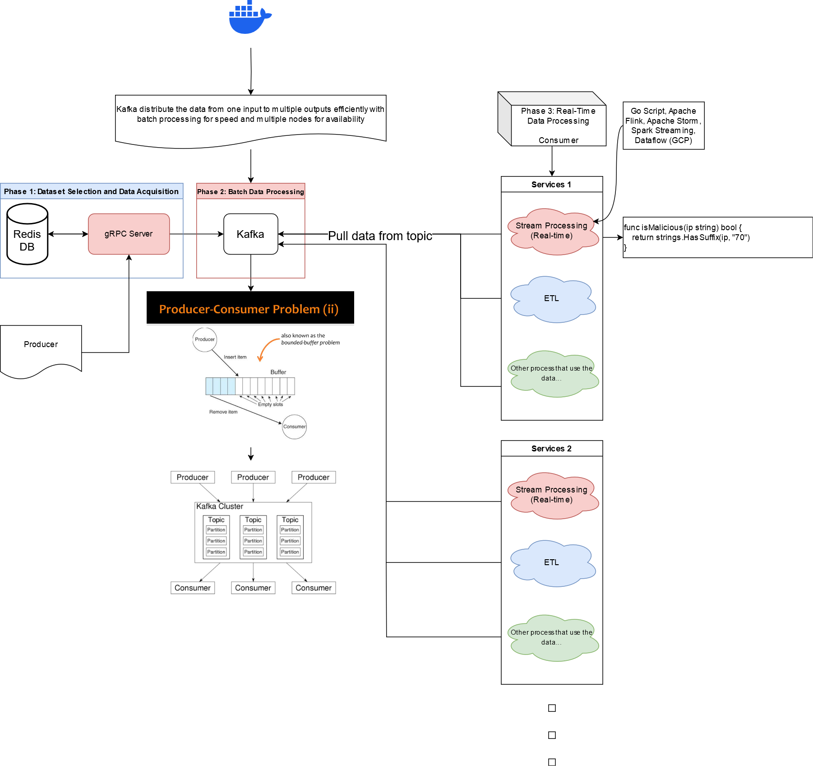

# DNS-Stream-Analyzer

DNS-Stream-Analyzer is a cloud-based project designed to simulate DNS traffic and detect malicious activity. It uses Kafka for data distribution and gRPC for the back-end. The project includes a server that processes DNS requests, a client that generates DNS traffic, and a consumer that processes messages from Kafka.

## Overview

- **Server**: Handles incoming DNS requests and checks if the IP is blacklisted. If not, it sends the request to Kafka.
- **Client**: Generates random DNS requests and sends them to the server.
- **Consumer**: Listens to Kafka topics and processes DNS requests.
- **Redis**: Used to store blacklisted IPs.
- **Kafka**: Used for message distribution.



## Quick Start

### Prerequisites

- Docker
- Docker Compose

### Running the Project

1. **Clone the repository**:

    ```bash
    git clone https://github.com/Raideeen/DNS-Stream-Analyzer.git
    cd DNS-Stream-Analyzer
    ```

2. **Build and run the Docker containers**:

    ```bash
    docker compose up --build
    ```

### Running Unit Tests

1. **Build and run the tests**:

    ```bash
    docker compose --profile tests up --build
    ```

## Project Structure

- **server/**: Contains the gRPC server implementation.
- **client/**: Contains the client that generates DNS requests.
- **consumer/**: Contains the Kafka consumer.
- **proto/**: Contains the protobuf definitions.
- **pb/**: Contains the generated protobuf code.
- **docker/**: Contains Dockerfiles for the server, client, and consumer.
- **compose.yml**: Docker Compose file to set up the entire environment.

## How It Works

1. **Client**: Generates random DNS requests and sends them to the gRPC server.
2. **Server**: Receives DNS requests, checks if the IP is blacklisted using Redis, and sends the request to Kafka if not blacklisted.
3. **Consumer**: Listens to Kafka topics, processes DNS requests, and can blacklist IPs based on certain criteria.

It should be noted that the *consumer* should be deployed on multiple machines depending on the incoming load. This would be done by generating the binary of `consumer/main.go` code and ensure that each machines that will run this binary has acccess to the Kafka broker and gRPC server.

## Example

To see the blacklisting in action, you can run the unit test that verifies if an IP address ending with 70 gets blacklisted after the first connection and is blocked on subsequent connections.

```go
package main

import (
 "context"
 "testing"
 "time"

 "github.com/Raideeen/DNS-Stream-Analyzer/pb"
 "github.com/go-redis/redis/v8"
 "github.com/stretchr/testify/assert"
 "google.golang.org/grpc"
 "google.golang.org/grpc/credentials/insecure"
)

const (
 // hostnames of containers defined in compose.yml 
 testAddress   = "grpc-server:50051" 
 testRedisAddr = "redis:6379"
)

func TestBlacklistIP(t *testing.T) {
 // Setup Redis client
 redisClient := redis.NewClient(&redis.Options{
  Addr: testRedisAddr,
 })
 defer redisClient.Close()

 // Flush the Redis database
 err := redisClient.FlushDB(redisClient.Context()).Err()
 if err != nil {
  t.Fatalf("Failed to flush Redis database: %v", err)
 }

 // Connect to the gRPC server
 conn, err := grpc.NewClient(testAddress, grpc.WithTransportCredentials(insecure.NewCredentials()))
 if err != nil {
  t.Fatalf("Failed to connect: %v", err)
 }
 defer conn.Close()

 client := pb.NewDnsServiceClient(conn)

 // Define the test IP address
 testIPAddress := "192.168.1.70"

 // First connection should succeed
 req := &pb.DnsRequest{
  IpAddress: testIPAddress,
  Domain:    "test.com",
  QueryType: "A",
  Timestamp: time.Now().Unix(),
 }
 resp, err := client.SendDnsRequest(context.Background(), req)
 assert.NoError(t, err)
 assert.Equal(t, "success", resp.GetStatus())

 // Block the IP address
 blockReq := &pb.BlockIpRequest{
  IpAddress: testIPAddress,
 }
 blockResp, err := client.BlockIp(context.Background(), blockReq)
 assert.NoError(t, err)
 assert.Equal(t, "success", blockResp.GetStatus())

 // Second connection should be blocked
 resp, err = client.SendDnsRequest(context.Background(), req)
 assert.NoError(t, err)
 assert.Equal(t, "blocked", resp.GetStatus())

 // Third connection should also be blocked
 resp, err = client.SendDnsRequest(context.Background(), req)
 assert.NoError(t, err)
 assert.Equal(t, "blocked", resp.GetStatus())
}
```

## License

This project is licensed under the MIT License - see the [LICENSE](LICENSE) file for details

## Contact Information

For any questions or discussions about the project, please reach out to us at `adrien.djebar@proton.me`.

## Acknowledgements

This project was developed as part of *Cloud Data structure* course at [École supérieure d'ingénieurs Léonard-de-Vinci (ESILV)](https://www.esilv.fr/) located at Paris La Défense with our amazing team composed of [Lucile Dresler](https://www.linkedin.com/in/luciledresler/), [Louis Bessard](https://www.linkedin.com/in/louis-bessard/) [(Github)](https://github.com/LouSarbe) and [myself](https://www.linkedin.com/in/adriendjebar/).

We would like to thanks our Cloud Data Structure professor but also researcher [Daniel Wladdimiro Cottet](https://www.linkedin.com/in/dwladdimiroc/) for his guidance and support.
